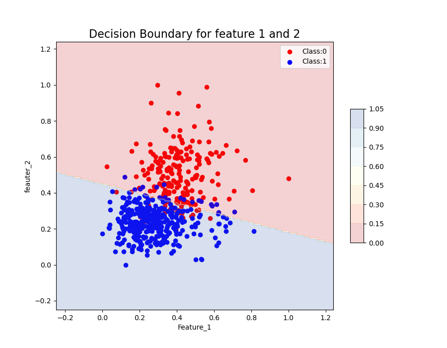

# Assignment 3

~ Submitted by Varun Jain

## Question 1

### Part A and B

Impletmeneted [here](..\Binnary_LR.py).

---

### Part C

Implemented [here](..\question1.py). 
Overal Accuracy: 93.3 %

---

### Part D

Here is the decision surface for features 0 and 1. Can be easily varied in the [code](..\question1.py#98).

  

---
