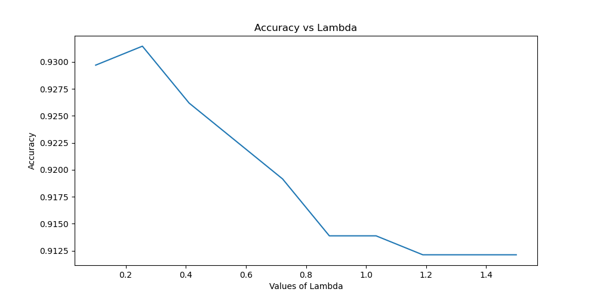
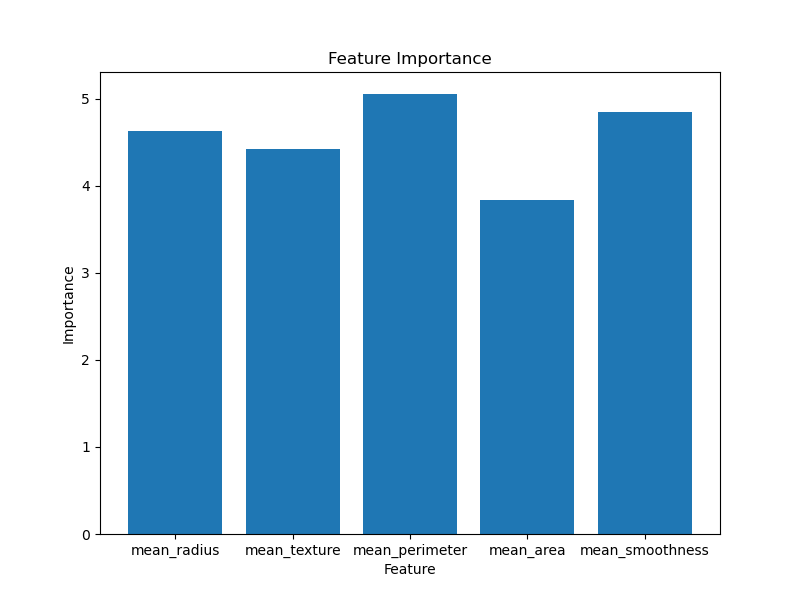

# Assignment 3

~ Submitted by Varun Jain

## Question 2

### Part A

Impletmeneted [here](https://github.com/varunjain3/Logistic_Regression/blob/main/Binnary_LR.py#L31).

---

### Part B

Implemented [here](https://github.com/varunjain3/Logistic_Regression/blob/main/question2.py). 

According to the Nested Cross-validation results, Here is the plot of Accuracy vs Lambda.

  

Also, the weights of the best model for each feature can explain us the importance, All the features were normalised.

  

---
