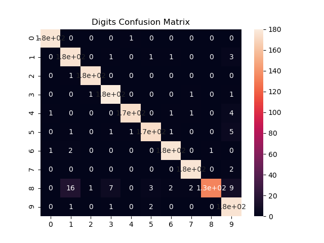

# Assignment 3

~ Submitted by Varun Jain

## Question 3

### Part A and B

Impletmeneted [here](https://github.com/varunjain3/Logistic_Regression/blob/main/K_class_LR.py#L47).

---

### Part C and D

Implemented [here](https://github.com/varunjain3/Logistic_Regression/blob/main/question3.py). 

Here is the confusion matrix on the Digits Dataset.

  

According to the confusion matrix, our classifier is having difficulties recognizing 8 and 1 apart. All other digits are being recognized easily specially 0, 2, 3 and 6

---

Here are the PCA analysis on the dataset.

  

We can note that according to PCA, digit 8 has a lot of overlaping features with other digits. While 0, 6 and 4 are highly seprable.
 
---
